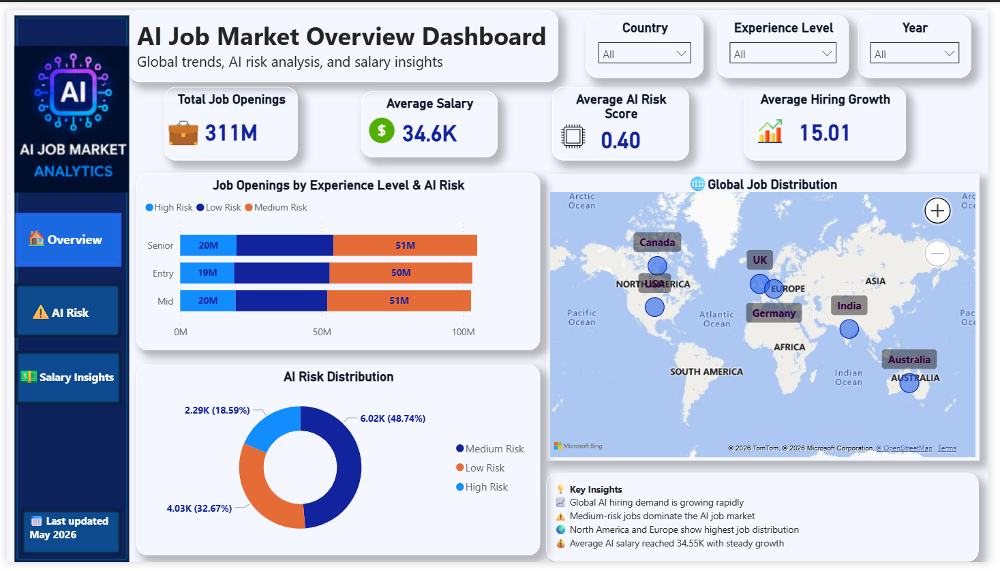
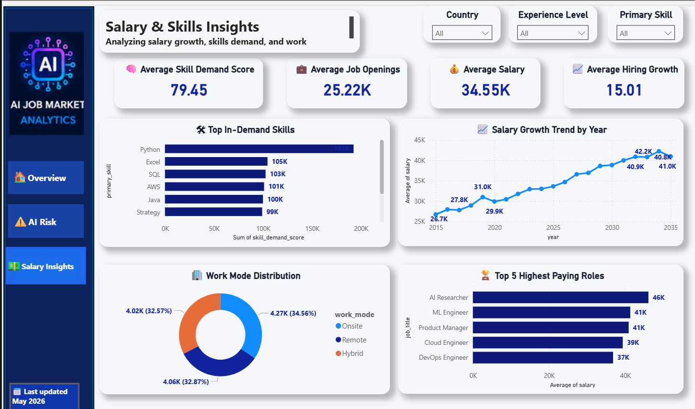

# AI Global Job Market Analytics Dashboard

## Project Overview

This Power BI dashboard analyzes global AI job market trends, hiring growth, salary patterns, skill demand, and automation risk across industries and countries.

The project helps understand how AI is transforming the workforce and highlights key opportunities and risks in the global job market.

---

## Tools Used

- Power BI
- DAX
- Power Query
- Microsoft Excel

---

## Dashboard Pages

### 1. AI Job Market Overview

Key metrics:
- Total Job Openings
- Average Salary
- Average AI Risk Score
- Hiring Growth Rate

Insights:
- Global job distribution by country
- Job openings by experience level
- AI risk distribution
- Hiring demand trends

### 2. AI Risk & Automation Analysis

Key metrics:
- Automation Probability
- High Risk Jobs
- Medium Risk Jobs
- Low Risk Jobs

Insights:
- AI risk trend over time
- Automation impact across industries
- Industry risk matrix
- Workforce automation exposure

### 3. Salary & Skill Insights

Key metrics:
- Skill Demand Score
- Average Salary
- Hiring Growth
- Job Openings

Insights:
- Most in-demand skills
- Salary growth trends
- Work mode distribution
- Highest paying AI roles

---

## Key Business Insights

- Global AI hiring continues to grow rapidly.
- Medium-risk jobs dominate the AI workforce.
- Python, SQL, and Excel remain highly demanded skills.
- AI-related salaries show strong long-term growth.
- North America and Europe lead global AI hiring.

---

## Skills Demonstrated

- Data Analysis
- Data Visualization
- Dashboard Development
- Business Intelligence
- DAX Calculations
- Trend Analysis
- Workforce Analytics

---

## Author

Asif Abbas

Aspiring Data Analyst | SQL | Power BI | Python | Excel

## Dashboard Screenshots

### AI Job Market Overview

### AI Risk & Automation Analysis

.png)

### Salary & Skill Insights

